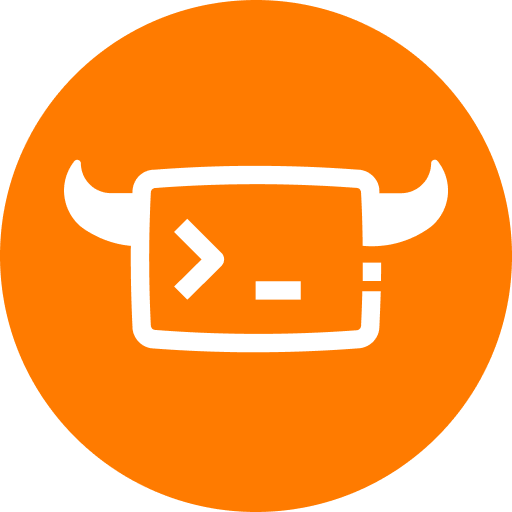

# Yaklang VS Code Extension

<div align="center">



**Complete Yaklang Language Support for VS Code**

[](https://marketplace.visualstudio.com/items?itemName=v1ll4n.yak)
[](https://marketplace.visualstudio.com/items?itemName=v1ll4n.yak)
[](https://marketplace.visualstudio.com/items?itemName=v1ll4n.yak)
[](LICENSE)

English | [简体中文](README_ZH.md)

</div>

---

## IMPORTANT: Version Requirements

**For LSP (Language Server Protocol) features to work properly, you MUST use Yak engine version 1.4.4-alpha1030b or later.**

- Extension Version: 1.4.1+
- Minimum Yak Engine Version: 1.4.4-alpha1030b

If you're using an older version of the Yak engine, LSP features (IntelliSense, code completion, diagnostics) will not function correctly.

---

## Features

### Language Support
- **Yaklang (.yak)** - Full language support including syntax highlighting, IntelliSense, and code completion
- **SyntaxFlow (.sf)** - Domain-specific language designed for security analysis

### Core Capabilities
- **IntelliSense** - Auto-completion, function signatures, parameter hints (requires Yak engine >= 1.4.4-alpha1030b)
- **Debugging** - Complete debugging support with breakpoints, step execution, variable inspection
- **Quick Run** - Execute Yak scripts instantly via CodeLens or keyboard shortcuts
- **Code Formatting** - Automatic code formatting for consistent style
- **Code Snippets** - Rich code templates to boost productivity
- **LSP Server** - Real-time code analysis powered by Language Server Protocol (requires Yak engine >= 1.4.4-alpha1030b)

### Engine Management
- **Auto Detection** - Automatically detect Yak engine from system PATH
- **Version Management** - Download, install, and switch between different Yak engine versions
- **Multi-language UI** - Switch between Chinese/English interface
- **Status Bar Integration** - Real-time display of current Yak engine version and status

---

## Installation

### Option 1: Install from VS Code Marketplace (Recommended)

1. Open VS Code
2. Go to Extensions view (`Ctrl+Shift+X` / `Cmd+Shift+X`)
3. Search for "Yaklang"
4. Click "Install"

### Option 2: Command Line Installation

```bash
code --install-extension v1ll4n.yak
```

### Option 3: Install from VSIX

1. Download the latest `.vsix` file from [Releases](https://github.com/yaklang/yaklang-support/releases)
2. In VS Code: `Extensions` → `...` → `Install from VSIX...`

---

## Quick Start

### 1. Install Yak Engine (Version >= 1.4.4-alpha1030b)

**CRITICAL**: For LSP features to work, you must install Yak engine version 1.4.4-alpha1030b or later.

**Option A: Auto-download via Extension**
1. Click the Yak version icon in the status bar
2. Select "Download Yak Engine"
3. Choose version 1.4.4-alpha1030b or later
4. Wait for the download to complete

**Option B: Manual Installation**
```bash
# Linux/macOS
curl -sfL https://yaklang.com/install.sh | bash

# Windows (PowerShell)
iwr -useb https://yaklang.com/install.ps1 | iex

# Verify version (must be >= 1.4.4-alpha1030b)
yak version
```

### 2. Configure Engine Path

The extension supports two modes:

- **Auto Mode (Recommended)**: Automatically use `yak` command from system PATH
- **Custom Mode**: Manually specify Yak engine path

Switch modes via status bar: Click Yak icon → Select the desired option

### 3. Start Coding

Create a `.yak` file and start coding:

```yak
// hello.yak
println("Hello, Yaklang!")

// Use built-in functions
http.Get("https://example.com", http.proxy("http://127.0.0.1:7890"))~
```

### 4. Run Your Script

- **CodeLens (Recommended)**: Click `Run Yak Script` button at the top of the file
- **Keyboard Shortcut**: `Cmd+Shift+B` (macOS) / `Ctrl+Shift+B` (Windows/Linux)
- **Context Menu**: Right-click → `Yak: Exec file`
- **Command Palette**: `Cmd+Shift+P` → `Yak: Exec file`

---

## Features in Detail

### CodeLens

Automatically displayed at the top of each `.yak` file:
- **Run Yak Script** - Execute the current script
- **Debug Yak Script** - Debug the current script

### Keyboard Shortcuts

| Function | Windows/Linux | macOS |
|----------|--------------|-------|
| Run Script | `Ctrl+Shift+B` | `Cmd+Shift+B` |
| Format Code | `Shift+Alt+F` | `Shift+Option+F` |
| Command Palette | `Ctrl+Shift+P` | `Cmd+Shift+P` |

### Command List

Access all commands via Command Palette (`Cmd+Shift+P` / `Ctrl+Shift+P`):

| Command | Description |
|---------|-------------|
| `Yak: Exec file` | Run current Yak script |
| `Yak: Debug file` | Debug current Yak script |
| `Yak: Format file` | Format current file |
| `Yak: Configure Engine` | Open engine configuration panel |
| `Yaklang: LSP Status` | View LSP server status |
| `Yaklang: Restart LSP Server` | Restart language server |
| `Yaklang: Download Yak Engine` | Download specific version of engine |
| `Yaklang: List Installed Versions` | View all installed engine versions |
| `Yaklang: Switch Language` | Switch interface language (Chinese/English) |

### Context Menu

Right-click in a `.yak` file to access:
- **Yak: Exec file** - Run script
- **Yak: Debug file** - Debug script
- **Yak: Format file** - Format code

---

## Configuration

### Basic Settings

```json
{
  // Engine source mode
  "yaklang.yakBinarySource": "auto",  // "auto" or "custom"
  
  // Custom engine path (only used in custom mode)
  "yaklang.yakBinaryPath": ""
}
```

### Configuration Details

#### `yaklang.yakBinarySource`
- **`auto`** (Recommended): Automatically find `yak` command from system PATH
- **`custom`**: Use custom path (requires `yakBinaryPath` configuration)

#### `yaklang.yakBinaryPath`
Full path to the custom Yak engine, for example:
- macOS/Linux: `/usr/local/bin/yak`
- Windows: `C:\Program Files\yaklang\yak.exe`

---

## Debugging

### Start Debugging

1. Set breakpoints in code (click left of line numbers)
2. Press `F5` or click CodeLens's `Debug Yak Script`
3. Use debug console to inspect variables, call stack, etc.

### Debug Configuration

Customize debug configuration in `.vscode/launch.json`:

```json
{
  "version": "0.2.0",
  "configurations": [
    {
      "type": "yak",
      "request": "launch",
      "name": "Debug Yak Script",
      "program": "${file}",
      "args": [],
      "env": []
    }
  ]
}
```

---

## Troubleshooting

### Issue: LSP Features Not Working

**MOST COMMON CAUSE**: You are using an older version of the Yak engine.

**Solution:**
1. Check your Yak engine version: Run `yak version` in terminal
2. If version is less than 1.4.4-alpha1030b, upgrade:
   - Click status bar Yak icon → "Download Yak Engine"
   - Select version 1.4.4-alpha1030b or later
3. Restart VS Code after upgrading

### Issue: CodeLens Not Showing

**Solutions:**
1. Check VS Code settings: `Settings` → `Editor` → Ensure `Editor: Code Lens` is enabled
2. Reload window: `Cmd+Shift+P` → `Developer: Reload Window`
3. Check file language mode is `Yak` (bottom-right status bar)

### Issue: Yak Engine Not Found

**Solutions:**
1. Click Yak icon in status bar
2. Select "Download Yak Engine" for automatic download (version >= 1.4.4-alpha1030b)
3. Or manually set engine path: Status bar → "Choose yak binary from file browser"

### Issue: LSP Server Not Starting

**Solutions:**
1. **First, verify Yak engine version >= 1.4.4-alpha1030b**
2. Open Command Palette: `Cmd+Shift+P`
3. Run: `Yaklang: Restart LSP Server`
4. Check output: `View` → `Output` → Select "Yaklang LSP"

### Issue: Code Completion Not Working

**Solutions:**
1. **Ensure Yak engine version >= 1.4.4-alpha1030b** (most common issue)
2. Check LSP server status: `Yaklang: LSP Status`
3. Restart LSP: `Yaklang: Restart LSP Server`
4. Restart VS Code

---

## Resources

- **Official Website**: [https://yaklang.com](https://yaklang.com)
- **Documentation**: [https://yaklang.com/docs](https://yaklang.com/docs)
- **GitHub**: [https://github.com/yaklang/yaklang](https://github.com/yaklang/yaklang)
- **Issue Tracker**: [https://github.com/yaklang/yaklang-support/issues](https://github.com/yaklang/yaklang-support/issues)

---

## Contributing

Contributions are welcome! Please see [CONTRIBUTING.md](CONTRIBUTING.md) for details.

### Ways to Contribute
- Report Bugs
- Suggest New Features
- Improve Documentation
- Submit Pull Requests

---

## License

This project is licensed under the [MIT License](LICENSE).

---

## Acknowledgments

Thanks to all developers who have contributed to the Yaklang ecosystem!

---

## Contact

- **Bug Reports**: [GitHub Issues](https://github.com/yaklang/yaklang-support/issues)
- **Feature Requests**: [GitHub Discussions](https://github.com/yaklang/yaklang-support/discussions)

---

<div align="center">

**[Back to Top](#yaklang-vs-code-extension)**

Made with love by the Yaklang Team

</div>
